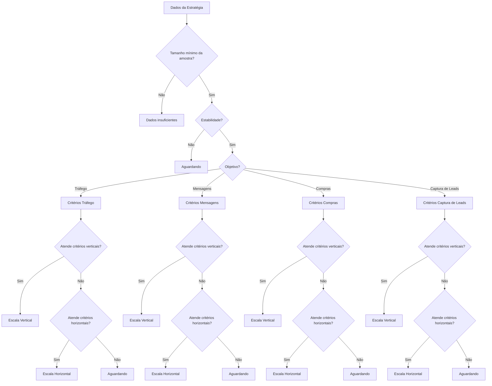

# 📊 Documentação - Sugestões para Público

## 🎯 Visão Geral

Este documento descreve a lógica e os textos das sugestões que aparecem para cada público nas estratégias de anúncio. As sugestões são baseadas em métricas de performance e seguem regras específicas para cada objetivo.

## 🏗️ Estrutura das Sugestões

### Tipos de Sugestão

1. **🟢 Escala Vertical** - Aumentar orçamento
2. **🔵 Escala Horizontal** - Expandir públicos/variações  
3. **⚪ Aguardando** - Aguardando otimização/mais dados

### Formato das Mensagens

```
[TIPO DE ESCALA]
[TOOLTIP ESPECÍFICO]
```

## 📋 Textos por Objetivo e Tipo

### 🎯 Objetivo: Tráfego

#### Escala Vertical (🟢)
```
Escalar orçamento (vertical).
Desempenho forte para Tráfego: CTR [X]%, CPC R$[X], LPV rate [X]%, freq [X]. Aumente orçamento gradualmente.
```

#### Escala Horizontal (🔵)
```
Expandir públicos/variações (horizontal).
Bom desempenho: CTR [X]%, CPC R$[X], freq [X]. Teste novos criativos/públicos (escala horizontal).
```

#### Aguardando (⚪)
```
Aguardando otimização: CTR [X]%, CPC R$[X], LPV rate [X]%, freq [X].
```

### 💬 Objetivo: Mensagens

#### Escala Vertical (🟢)
```
Escalar orçamento (vertical).
Desempenho forte para Mensagens: CTR [X]%, CPL R$[X], [X] leads, freq [X]. Aumente orçamento gradualmente.
```

#### Escala Horizontal (🔵)
```
Expandir públicos/variações (horizontal).
Bom desempenho: CTR [X]%, CPL R$[X], freq [X]. Teste novos criativos/públicos (escala horizontal).
```

#### Aguardando (⚪)
```
Aguardando otimização: CTR [X]%, CPL R$[X], [X] leads, freq [X].
```

### 🛒 Objetivo: Compras

#### Escala Vertical (🟢)
```
Escalar orçamento (vertical).
Compras consistentes: CPR R$[X], ROAS [X]x, [X] vendas, freq [X]. Escale orçamento (vertical).
```

#### Escala Horizontal (🔵)
```
Expandir públicos/variações (horizontal).
Algumas compras: CPR R$[X], ROAS [X]x. Expandir públicos/criativos (horizontal).
```

#### Aguardando (⚪)
```
Pouca sinalização de compras ou métricas fora do alvo: CPR R$[X], ROAS [X]x, [X] vendas, freq [X].
```

### 👥 Objetivo: Captura de Leads

#### Escala Vertical (🟢)
```
Escalar orçamento (vertical).
Captura de leads eficiente: CPL R$[X], [X] leads, CTR [X]%, freq [X]. Escale orçamento (vertical).
```

#### Escala Horizontal (🔵)
```
Expandir públicos/variações (horizontal).
Boa captura de leads: CPL R$[X], [X] leads, CTR [X]%. Teste novos criativos/públicos (horizontal).
```

#### Aguardando (⚪)
```
Aguardando otimização para captura de leads: CPL R$[X], [X] leads, CTR [X]%, freq [X].
```

### 📊 Dados Insuficientes

```
Dados insuficientes: [X] impressões, [X] cliques. Mínimo: 3.000 impressões e 100 cliques ou gasto ≥ 2× CPA/CPL alvo.
```

## 🔍 Lógica de Decisão

### Regras Gerais

1. **Tamanho mínimo da amostra**: Impressões ≥ 3.000 e cliques ≥ 100 ou gasto ≥ 2× CPA/CPL alvo
2. **Estabilidade**: Média móvel de 3-7 dias com 2 dias consecutivos consistentes
3. **Frequência**: ≤ 2.5 para compras/captura de leads, ≤ 3.0 para outros objetivos

### Critérios por Objetivo

#### 🎯 Tráfego
- **Vertical**: CTR ≥ 1.5%, CPC ≤ 1.20, LPV rate ≥ 70%, freq ≤ 3.0
- **Horizontal**: CTR ≥ 1.0%, CPC ≤ 2.50, freq ≤ 3.0
- **Aguardando**: Demais casos

#### 💬 Mensagens
- **Vertical**: CTR ≥ 1.5%, CPL ≤ 15, ≥ 10 leads, freq ≤ 2.5
- **Horizontal**: CTR ≥ 1.0%, CPL ≤ 25, freq ≤ 2.5
- **Aguardando**: Demais casos

#### 🛒 Compras
- **Vertical**: ≥ 3 vendas, CPR ≤ 30, ROAS ≥ 1.5x, freq ≤ 2.5
- **Horizontal**: CPR ≤ 39 (30 × 1.3), ROAS ≥ 1.2x (1.5 × 0.8), freq ≤ 3.0
- **Aguardando**: Demais casos

#### 👥 Captura de Leads
- **Vertical**: ≥ 10 leads, CPL ≤ 15, CTR ≥ 1.5%, freq ≤ 2.5
- **Horizontal**: CPL ≤ 19.5 (15 × 1.3), CTR ≥ 1.0%, freq ≤ 3.0
- **Aguardando**: Demais casos

## 🎨 Cores e Ícones

### Escala Vertical (🟢)
- **Cor**: Verde (emerald-600/15)
- **Ícone**: TrendingUp
- **Borda**: emerald-500/40

### Escala Horizontal (🔵)
- **Cor**: Azul (blue-600/15)
- **Ícone**: GitBranch
- **Borda**: blue-500/40

### Aguardando (⚪)
- **Cor**: Cinza (slate-600/15)
- **Ícone**: Clock
- **Borda**: slate-500/40

## 🔄 Fluxo de Decisão



## 📝 Exemplos Práticos

### Exemplo 1: Tráfego - Escala Vertical
```
Escalar orçamento (vertical).
Desempenho forte para Tráfego: CTR 2.15%, CPC R$1,20, LPV rate 75.3%, freq 2.1. Aumente orçamento gradualmente.
```

### Exemplo 2: Mensagens - Escala Horizontal
```
Expandir públicos/variações (horizontal).
Bom desempenho: CTR 1.25%, CPL R$18,50, freq 2.8. Teste novos criativos/públicos (escala horizontal).
```

### Exemplo 3: Compras - Aguardando
```
Pouca sinalização de compras ou métricas fora do alvo: CPR R$45,00, ROAS 1.2x, 2 vendas, freq 3.5.
```

### Exemplo 4: Captura de Leads - Escala Vertical
```
Escalar orçamento (vertical).
Captura de leads eficiente: CPL R$12,50, 15 leads, CTR 1.8%, freq 2.2. Escale orçamento (vertical).
```

## 🔧 Configurações

### Valores Alvo por Objetivo

| Objetivo | CPL/CPC Alvo | ROAS Alvo | Leads Mínimos | Vendas Mínimas | Frequência Máxima |
|----------|--------------|-----------|---------------|----------------|-------------------|
| Tráfego | CPC ≤ 1.20 | - | - | - | 3.0 |
| Mensagens | CPL ≤ 15 | - | 10 | - | 2.5 |
| Compras | CPR ≤ 30 | ≥ 1.5x | - | 3 | 2.5 |
| Captura de Leads | CPL ≤ 15 | - | 10 | - | 2.5 |

### Tolerâncias para Escala Horizontal

- **CPL/CPC**: Até 30% acima do alvo
- **ROAS**: Até 20% abaixo do alvo
- **Frequência**: Até 3.0 (2.5 para compras/captura de leads)

## 📊 Métricas Utilizadas

- **CTR**: Click-Through Rate
- **CPC**: Cost Per Click
- **CPL**: Cost Per Lead
- **CPR**: Cost Per Result (Purchase)
- **ROAS**: Return on Ad Spend
- **LPV Rate**: Landing Page View Rate
- **Frequência**: Impressões / Reach único

## 🎯 Objetivo da Documentação

Esta documentação serve como referência para:
1. **Desenvolvedores**: Entender a lógica de decisão
2. **Usuários**: Compreender as sugestões recebidas
3. **Manutenção**: Atualizar critérios e textos
4. **Testes**: Validar comportamento esperado

